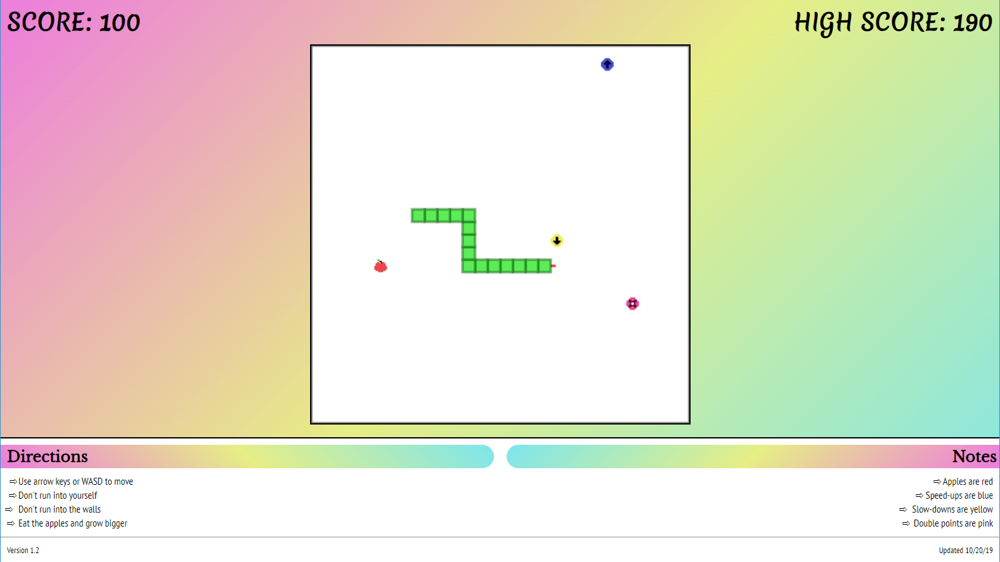

# WhackySnake

Classic snake game, but with a few powerups to alter the gameplay!

[Play it here][live]



## Features

- Base snake game

- 3 powerups

  - Speed up, increases your speed permanently (stackable)

  - Slow down, decreases your speed permanently (stackable)

  - Point multiplier, doubles all points earned for a limited time (unstackable)

- 3 board sizes for bigger or smaller games

## Tools & Technologies

- JavaScript

- LESS (CSS)

- HTML (Canvas)

## Setup & Running

1. Clone this repository

   ```bash
   git clone <link> <location>
   ```

You're done, it's made with native web technologies & you can just open the `index.html` file to start playing locally.

**Note**: Desktop only, mobile is not supported.

[live]: https://mrcookiefries.github.io/WhackySnake/
